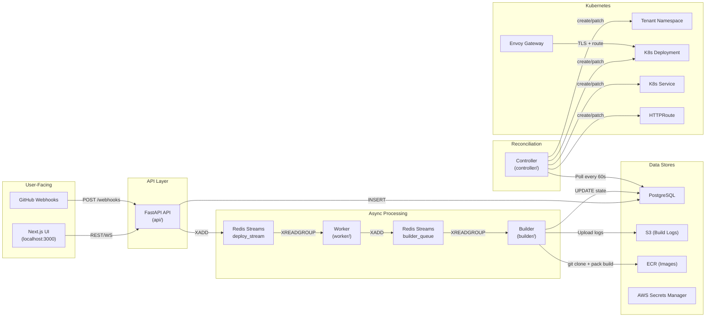

# ShipZen — Full Project Analysis

> [!NOTE]
> **Up to Date:** This document reflects the current, stabilized architecture of ShipZen. For a historical log of encountered issues and their resolutions, refer to `ISSUES_AND_RESOLUTIONS.md`.

## What ShipZen Is

ShipZen is an **Internal Developer Platform (IDP)** — a self-service system where a developer pushes a repo URL, and the platform automatically builds a container image, deploys it to Kubernetes, and routes traffic to it via a unique subdomain. Think of it as a mini Heroku/Vercel built on top of EKS.

---

## Architecture Overview

---

## Data Flow — End to End

### 1. User creates a Project
`POST /projects` → inserts a row in `projects` table with `status=Provisioning`. The **Controller** picks this up on its next reconciliation tick (every 60s), renders the [tenant.yaml.j2](file:///c:/Project/ShipZen/controller/templates/tenant.yaml.j2) template, and creates the Kubernetes Namespace, ResourceQuota, LimitRange, NetworkPolicy, RBAC, and ECR pull secret. Once the namespace is verified as existing, the project moves to `Ready`.

### 2. User submits a Deployment
`POST /projects/{id}/deployments` → inserts a `deployments` row with `state=Queued`, auto-generates the image URI (`ECR_URL:deployment_id`), and enqueues a message to `deploy_stream` via Redis Streams.

### 3. Worker picks it up
The [Worker](file:///c:/Project/ShipZen/worker/main.py) runs an infinite `XREADGROUP` loop. It validates the message, checks for idempotency (skips if already Building/Deploying/Running), transitions the deployment to `Building`, and hands the message off to `builder_queue`.

### 4. Builder builds the image
The [Builder](file:///c:/Project/ShipZen/builder/main.py) (scaled by KEDA from 0→N based on pending messages) clones the repo, runs `pack build --publish` (Cloud Native Buildpacks), streams logs to S3, checks ECR image scan results, and writes the final state to PostgreSQL. On success → `Deploying`. On failure → `Failed`.

### 5. Controller reconciles the deployment
The [Controller](file:///c:/Project/ShipZen/controller/main.py) sees `state=Deploying`, renders [app-deployment.yaml.j2](file:///c:/Project/ShipZen/controller/templates/app-deployment.yaml.j2) (Deployment + Service + HTTPRoute + PDB + ExternalSecret), applies it to K8s, and watches for ready replicas. Once replicas are healthy → `Running`. If replicas crash → `Failed`.

### 6. Traffic is routed
Envoy Gateway terminates TLS on `*.shipzen.jeneeldumasia.codes` and routes based on hostname `{dep-id-8chars}.{project-name}.shipzen.jeneeldumasia.codes`.

---

## Component Breakdown

| Component | Language | Purpose | Lines |
|-----------|----------|---------|-------|
| [api/main.py](file:///c:/Project/ShipZen/api/main.py) | Python/FastAPI | HTTP API, Redis enqueue | 791 |
| [api/auth.py](file:///c:/Project/ShipZen/api/auth.py) | Python | Auth0 JWT validation | 132 |
| [api/database.py](file:///c:/Project/ShipZen/api/database.py) | Python | DB connection + retention | 70 |
| [api/audit.py](file:///c:/Project/ShipZen/api/audit.py) | Python | Append-only audit logging | 71 |
| [worker/main.py](file:///c:/Project/ShipZen/worker/main.py) | Python | Redis consumer, state machine | 122 |
| [worker/state_machine.py](file:///c:/Project/ShipZen/worker/state_machine.py) | Python | PostgreSQL state transitions | 81 |
| [builder/main.py](file:///c:/Project/ShipZen/builder/main.py) | Python | Image builder (pack) | 305 |
| [controller/main.py](file:///c:/Project/ShipZen/controller/main.py) | Python | K8s reconciliation loop | 284 |
| [ui/](file:///c:/Project/ShipZen/ui) | Next.js/TS | Dashboard + deploy forms | — |

---

## What's Done Well

The project has strong fundamentals:

- ✅ **Genuine multi-tenancy isolation** — namespace-per-project with ResourceQuota, LimitRange, NetworkPolicy, RBAC, and PSA `restricted` enforcement is textbook
- ✅ **Proper secret management** — ESO + AWS Secrets Manager, not hardcoded K8s secrets
- ✅ **DLQ pattern** — dead letter queue for failed deployments prevents infinite retry loops
- ✅ **Idempotency guards** in the worker (checking deployment state before processing)
- ✅ **Build timeout + workspace cleanup** in the builder
- ✅ **ECR image scanning gate** — blocks deployments with critical CVEs
- ✅ **Audit logging** with append-only semantics and non-blocking writes
- ✅ **HTTP→HTTPS redirect** on the Gateway
- ✅ **PodDisruptionBudgets** with `maxUnavailable` (not `minAvailable`) — correctly handles single-replica deployments
- ✅ **Karpenter node isolation** — builder and tenant workloads on separate node pools with taints
- ✅ **IRSA everywhere** — no static AWS credentials in the cluster
- ✅ **GitHub Actions OIDC** with subject restriction to `main` branch only

