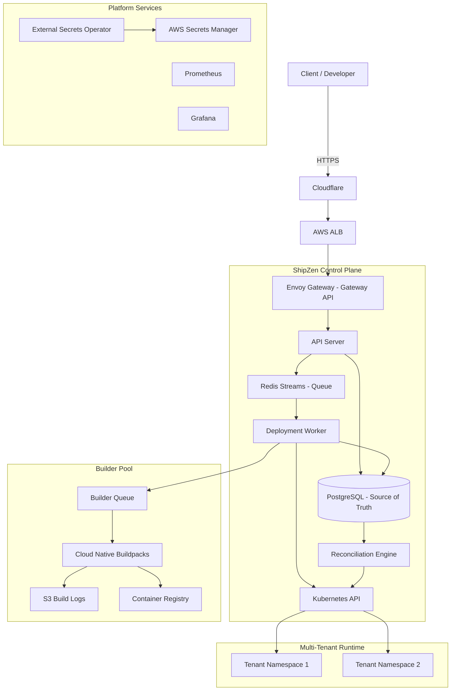

# Target Architecture Diagram

```mermaid
graph TD
    Client[Client / Developer] -->|HTTPS| CF[Cloudflare]
    CF --> ALB[AWS ALB]
    ALB --> EG[Envoy Gateway - Gateway API]
    
    subgraph ShipZen Control Plane
        EG --> API[API Server]
        API --> Redis[Redis Streams - Queue]
        API --> Postgres[(PostgreSQL - Source of Truth)]
        
        Redis --> Worker[Deployment Worker]
        Worker --> Postgres
        Worker --> K8sAPI[Kubernetes API]
        
        Postgres --> Controller[Reconciliation Engine]
        Controller --> K8sAPI
    end
    
    subgraph Builder Pool
        Worker --> BuilderQueue[Builder Queue]
        BuilderQueue --> Builder[Cloud Native Buildpacks]
        Builder --> S3_Logs[S3 Build Logs]
        Builder --> Registry[Container Registry]
    end
    
    subgraph Multi-Tenant Runtime
        K8sAPI --> T1[Tenant Namespace 1]
        K8sAPI --> T2[Tenant Namespace 2]
    end
    
    subgraph Platform Services
        ESO[External Secrets Operator] --> AWS_SM[AWS Secrets Manager]
        Prometheus[Prometheus]
        Grafana[Grafana]
    end
```
