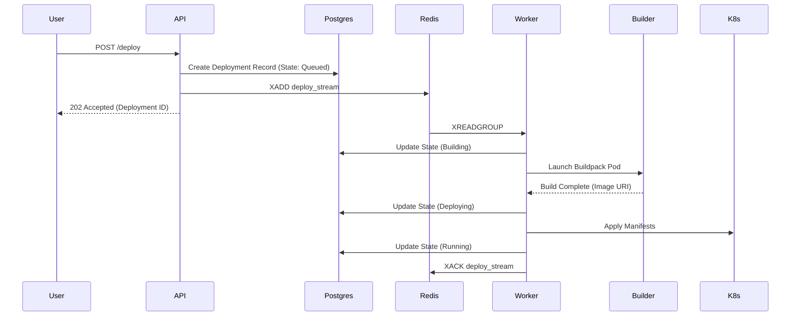

# Service Interaction Diagram

```mermaid
sequenceDiagram
    participant User
    participant API
    participant Postgres
    participant Redis
    participant Worker
    participant Builder
    participant K8s
    
    User->>API: POST /deploy
    API->>Postgres: Create Deployment Record (State: Queued)
    API->>Redis: XADD deploy_stream
    API-->>User: 202 Accepted (Deployment ID)
    
    Redis->>Worker: XREADGROUP
    Worker->>Postgres: Update State (Building)
    Worker->>Builder: Launch Buildpack Pod
    Builder-->>Worker: Build Complete (Image URI)
    Worker->>Postgres: Update State (Deploying)
    Worker->>K8s: Apply Manifests
    Worker->>Postgres: Update State (Running)
    Worker->>Redis: XACK deploy_stream
```
