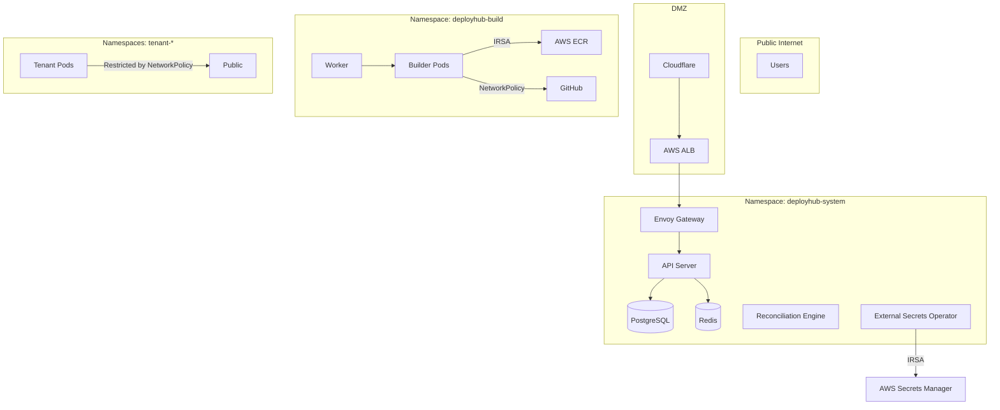

# Security Boundary Diagram

```mermaid
graph TD
    subgraph Public Internet
        Users
    end
    
    subgraph DMZ
        Cloudflare --> AWS_ALB[AWS ALB]
    end
    
    subgraph DeployHub Platform [Namespace: deployhub-system]
        AWS_ALB --> Envoy[Envoy Gateway]
        Envoy --> API[API Server]
        API --> Postgres[(PostgreSQL)]
        API --> Redis[(Redis)]
        Controller[Reconciliation Engine]
        ESO[External Secrets Operator]
    end
    
    subgraph Builder Isolation [Namespace: deployhub-build]
        Worker --> Builder[Builder Pods]
        Builder -- IRSA --> ECR[AWS ECR]
        Builder -- NetworkPolicy --> ExternalGit[GitHub]
    end
    
    subgraph Tenant Isolation [Namespaces: tenant-*]
        Pod1[Tenant Pods]
        Pod1 -- Restricted by NetworkPolicy --> Public
    end
    
    ESO -- IRSA --> SecretsManager[AWS Secrets Manager]
```
