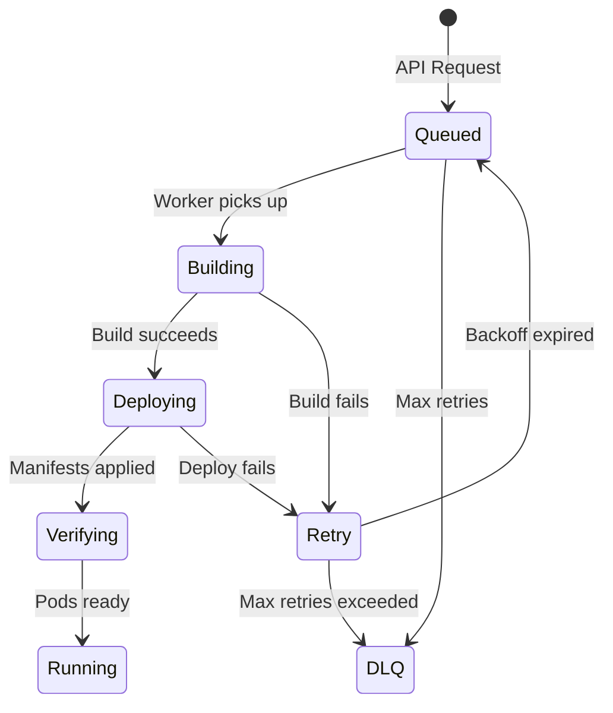

# Deployment Flow Diagram

```mermaid
stateDiagram-v2
    [*] --> Queued: API Request
    Queued --> Building: Worker picks up
    Building --> Deploying: Build succeeds
    Deploying --> Verifying: Manifests applied
    Verifying --> Running: Pods ready
    
    Queued --> DLQ: Max retries
    Building --> Retry: Build fails
    Deploying --> Retry: Deploy fails
    Retry --> Queued: Backoff expired
    Retry --> DLQ: Max retries exceeded
```
